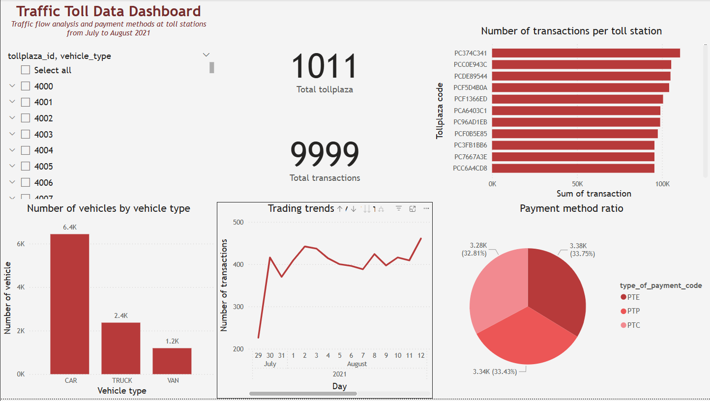

# 🚦 Real-time Traffic Toll Data Dashboard

A real-time data pipeline and dashboard for analyzing vehicle traffic and payment trends at toll stations using **Apache Airflow**, **Kafka**, **MySQL**, and **Power BI**.



---

## 🗂️ Overview

This project demonstrates an end-to-end **ETL pipeline** to collect, process, store, and visualize traffic toll data using modern data engineering tools.

### 🎯 Key Objectives:
- Automate ETL process using **Apache Airflow**
- Stream and ingest data using **Apache Kafka**
- Store processed data in **MySQL**
- Visualize insights using **Power BI**

---

## 🔧 Tech Stack

| Component    | Technology                     |
|--------------|-------------------------------|
| ETL Workflow | Apache Airflow                |
| Streaming    | Apache Kafka (`kafka-python`) |
| Storage      | MySQL (`mysql-connector-python`) |
| Visualization| Power BI Desktop              |
| Programming  | Python 3.8+                   |

---

## 📌 Features

- ✅ **Automated ETL** with Airflow (download, extract, consolidate, and transform)
- ✅ **Real-time ingestion** via Kafka Producer & Consumer
- ✅ **MySQL integration** for persistent storage
- ✅ **Interactive Power BI dashboard** with filters:
  - Traffic by vehicle type
  - Transactions by toll plaza
  - Payment method breakdown
  - Volume trend over time

---

## 📂 Project Structure

```
.
├── dags/
│   └── python_etl/
│       ├── etl_pipeline.py   # Airflow DAG file
│       └── staging/          # Intermediate storage
├── kafka/
│   ├── producer.py           # Kafka producer for transformed CSV
│   └── consumer.py           # Kafka consumer to insert into MySQL
├── mysql/
│   └── schema.sql            # Table schema for MySQL
├── powerbi/
│   └── dashboard.pbix        # Power BI dashboard file
├── requirements.txt
└── README.md
```

---

## 🚀 Pipeline Flow

1. **Airflow ETL Pipeline**:
    - Downloads and extracts raw toll data (CSV, TSV, Fixed-width).
    - Consolidates into a unified CSV.
    - Transforms vehicle types (uppercase normalization).

2. **Kafka Streaming**:
    - `producer.py`: Reads transformed CSV and sends records to Kafka topic.
    - `consumer.py`: Listens to Kafka topic and inserts data into MySQL.

3. **Data Storage**:
    - MySQL database stores cleaned data from Kafka Consumer.

4. **Power BI Dashboard**:
    - Connects to MySQL to visualize and analyze real-time traffic and toll trends.

---

## ⚙️ Setup Instructions

### ✅ Prerequisites
- Python 3.8+
- Docker or local setup for:
  - Kafka (port: `9092`)
  - MySQL (port: `3307`)
  - Apache Airflow
- Power BI Desktop

### 🔧 Installation

1. **Clone the Repository**
```bash
git clone https://github.com/your-username/toll-data-dashboard.git
cd toll-data-dashboard
```

2. **Install Python Dependencies**
```bash
pip install -r requirements.txt
```

3. **Start Kafka & MySQL** (via Docker Compose or manually)

4. **Setup Airflow**
- Place the ETL DAG in `dags/python_etl/etl_pipeline.py`.
- Start Airflow webserver and scheduler.
```bash
airflow standalone
```

5. **Run Kafka Producer & Consumer**
```bash
python kafka/producer.py
python kafka/consumer.py
```

6. **Configure Power BI**
- Open `powerbi/dashboard.pbix`
- Set up connection to MySQL to load and refresh data.

---

## 🧠 Notes

- Airflow DAG runs daily to simulate new data ingestion.
- Kafka allows near real-time updates to the dashboard via streaming.
- The pipeline is modular and scalable — you can connect other data sources or outputs as needed.

---

## 👨‍💻 Author

**Duy Hosinguyen**  
Email: hosinguyenn@gmail.com  
GitHub: [your-github-profile](https://github.com/your-github-profile)

---

## 📃 License

MIT License. See `LICENSE` file for more details.
